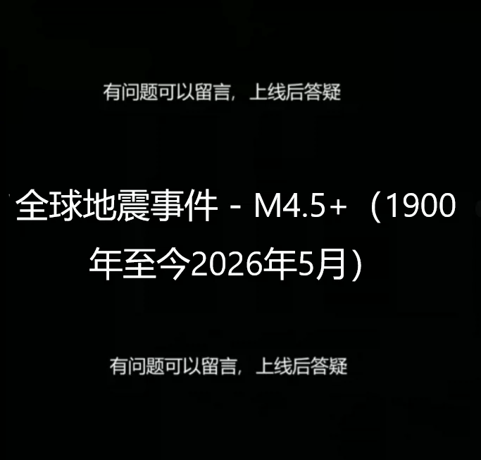
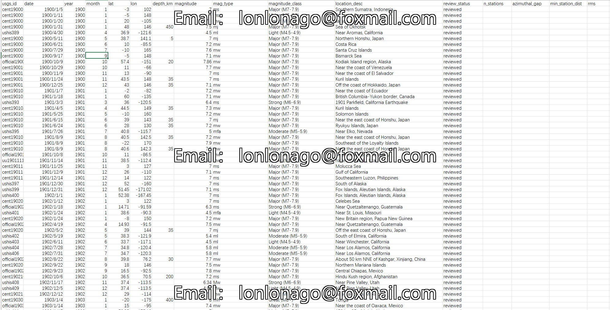
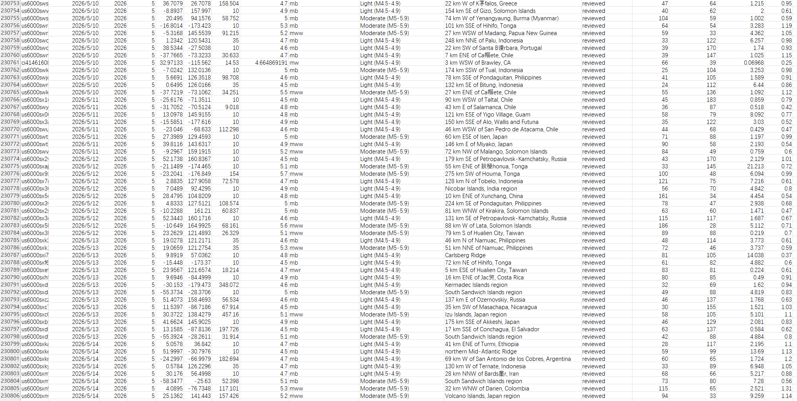

## Body

Global Earthquake Events - M4.5+ (1900-2026 May)

Over 120 years of global seismic activity, with magnitudes reaching or exceeding 4.5

This dataset includes records of global earthquake events from 1900 to the present day. Each entry typically contains:

Timestamp: The date and time of the event.
Coordinates: The latitude and longitude of the epicenter.
Depth: The depth of the earthquake (in kilometers).
Intensity: The Richter scale or Moment magnitude (both ≥ 4.5).
Location: A geographical description of the active area.

Source: These data are primarily compiled from the United States Geological Survey's Earthquake Disaster Project and other international seismological institutions.

## Images

item_1053499216112

Here is a pay link on Stripe ( https://buy.stripe.com/3cs8yP7sY87d0vu9AB ). Please contact me lonlonago@foxmail.com after funding $89, and I will send you a complete data files , thank you!

